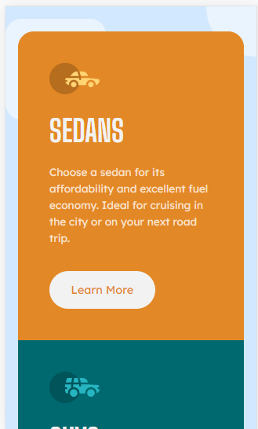
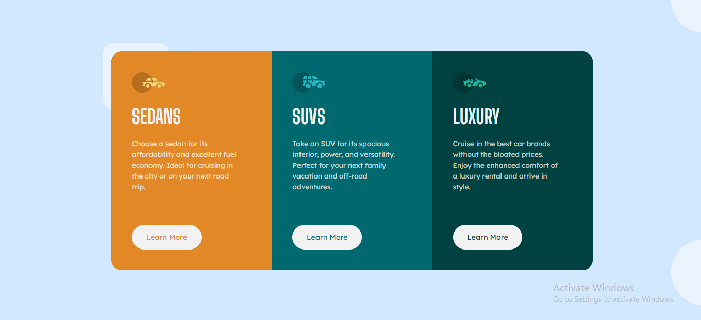

# FrontEnd Mentor Challenge

## 3 - Column Preview Card Component

 

 

This is a solution to the [3-column preview card component challenge on Frontend Mentor](https://www.frontendmentor.io/challenges/3column-preview-card-component-pH92eAR2-). Frontend Mentor challenges help you improve your coding skills by building realistic projects. 

## Table of contents

- [Overview](#overview)
  - [The challenge](#the-challenge)
  - [Screenshot](#screenshot)
  - [Links](#links)
- [My Process](#my-process)
  - [Built with](#built-with)
  - [What I learned](#what-i-learned)
  - [Continued development](#continued-development)
- [Author](#author)
## Overview

### The Challenge

Users should be able to:

- View the optimal layout depending on their device's screen size
- See hover states for interactive elements

### Screenshot

- #### Mobile
    
- #### Desktop
    

### Links

- Solution Url : [Click Here](later.com)
- Live Site Url : [Click Here](later.com)

## My process

### Built with

- Semantic HTML5 markup
- CSS custom properties
- Flexbox
- CSS Grid

### What I learned

    1. Css Varibles
    2. FlexBox properties
        - flex
        - justify-content
    3. Best way to approach a responsive design
    4. Placing geometric shapes to improve DESIGN

### Continued development

- [ ]  Small paralax to Geometric shapes